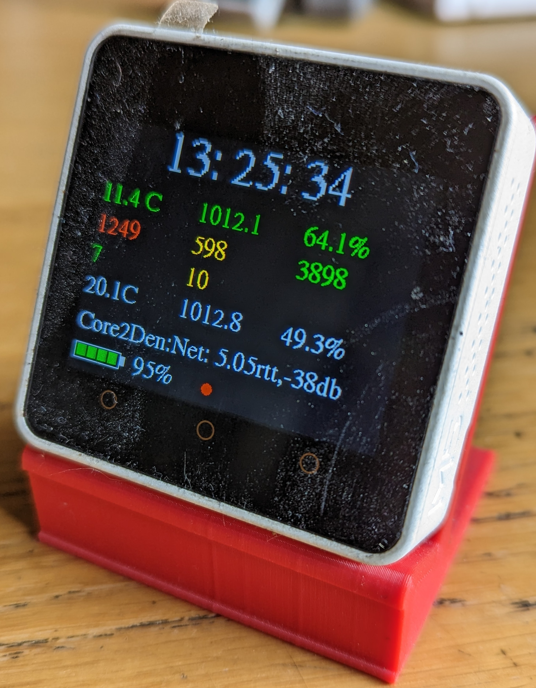

# M5Stack-Core2 UDP Sensor display
M5Stack Core2 UDP connected sensor display

This code drives an M5Stack Core2 display. \
It's connected to a WiFi network that remote sensors broadcast on. 
1. Sensor Data is read fromm UDP port 6124.
2. Diagnostic messages (such as WiFi signal strength,OTP status Etc) arrive on UDP port 6125.
3. A Time Atomic International (GPS) DTG is broadcast on UDP port 6123. \

Locally connected sensors can be added to the I2C port for indoor sensors. These are enumerated and any provided drivers invoked. \
The three broadcasts are read and the formatted payload output to the built in display, along with the Core2 current battery state. \

Sample sensor servers can be found in the External_Sensors directory. 

At some stage I prommise to remove the mucky dust ridden celophane protective cover off the screen...
  

